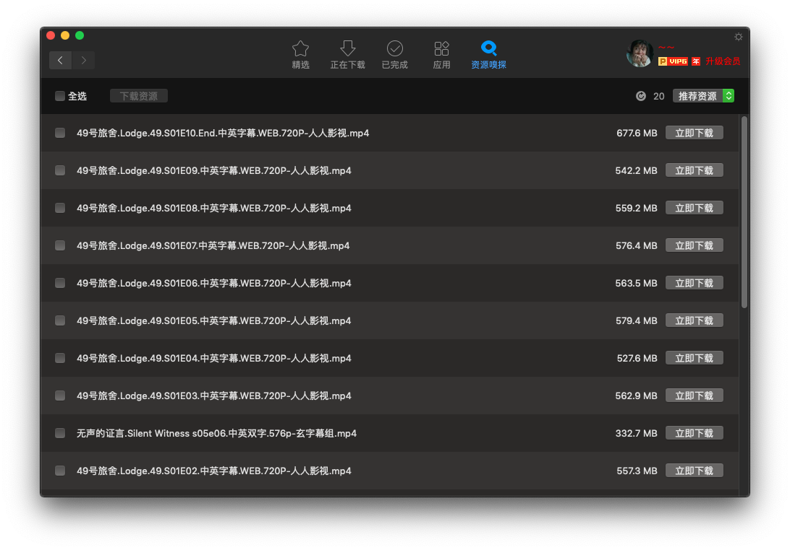
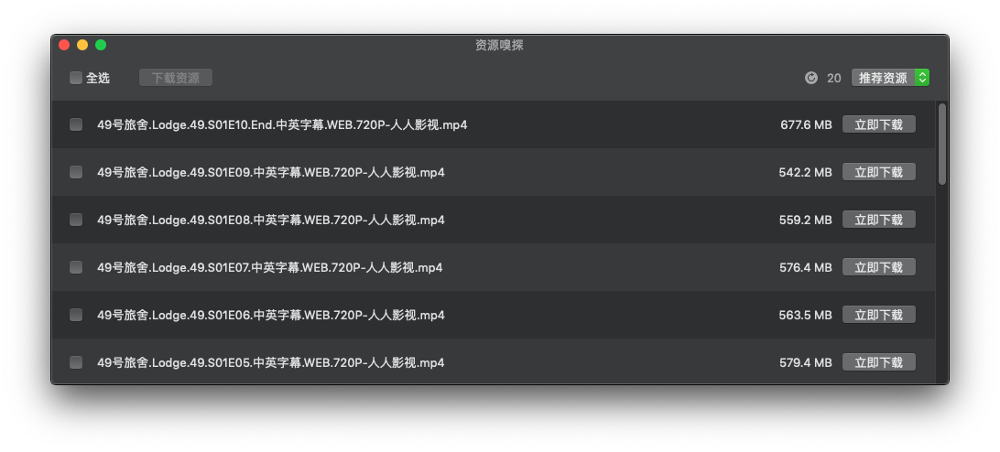

## 资源搜索

---

### 目标：

实现macOS/iOS 资源的快捷查找。

### 模块介绍：

-  `Spider.app` 是macOS 10.11平台的独立搜索软件
-  `sniffer.xlpulgin` 是mac迅雷3.2.0以及后续版本的插件
-  `iSpider` 是iOS11平台的独立资源搜索软件 

### TODO:

iSpider 待实现

### 参与开发：

``` bash
git clone https://github.com/TidleCao/AppleSpider.git
cd AppleSpider && ./Sniffer/setup.command
```

### 效果预览 - spider.xlplugin



### 效果预览 - Spider.app




